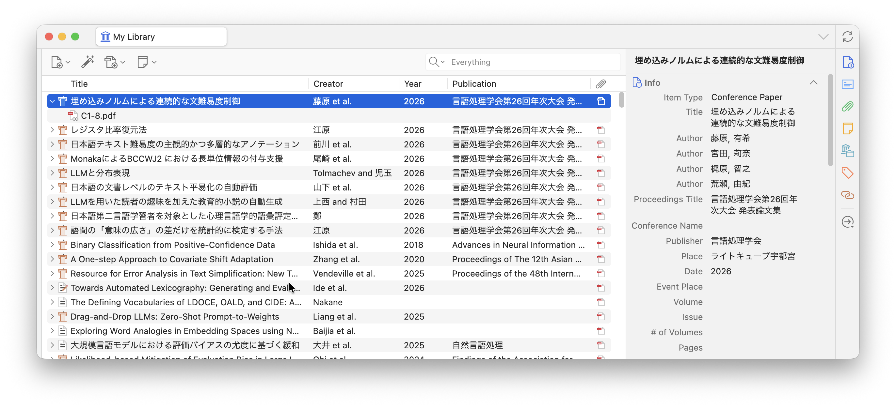

# ZotANLP



[English](#english) below.

## 日本語

ZotANLP は、ANLP（言語処理学会）論文 PDF（例: `B2-3.pdf`）のメタデータを Zotero に付与するプラグインです。

### 注意

- このプラグインおよびこの README は OpenAI Codex によって作成されています。
- 利用時は必ず結果を確認し、必要に応じて手動で修正してください。

### バージョン履歴

- `v0.2.3`
  - 既存の親アイテムを更新する前に `conferencePaper` 型へ変更するように修正
  - 著者名の先頭記号として `◊` を削除するように修正
  - 2026 年版の表形式プログラムで著者行と PDF URL を正しく抽出するように修正
  - 自動処理が Zotero の親アイテム作成と競合して重複親アイテムを作らないように修正
  - 年別メタデータキャッシュを更新し、古い著者メタデータを再利用しないように修正
  - 最近の PDF 形式から発表論文集のページ範囲を抽出し、`pages` フィールドに設定する機能を追加
- `v0.2.2`
  - Zotero 9.0 系との互換性を宣言（`strict_max_version` を `9.0.*` に更新）
- `v0.2.1`
  - GitHub Releases の `updates.json` を使ったプラグイン自動更新に対応
  - `build.sh` を追加し、`release/ZotANLP.xpi` と `release/updates.json` を生成可能に
- `v0.2.0`
  - 空白なし日本語著者名の自動分割を追加（ENAMDICT ベース）
  - 日本語要旨の空白処理を改善
  - URL がない ANLP 論文の認識を改善（PDF から年を推定）
  - 古い大会ページ形式への対応を改善（初期大会のサイト形式差異に対応）
  - UI を改善（メニュー項目、ダイアログ）
- `v0.1.0`
  - PDF 1ページ目からの要旨/Abstract 抽出を追加（日本語/英語対応）
  - `Settings -> ZotANLP` に設定パネルを追加
  - 細かな改善（親アイテムからの手動実行、UI 更新の改善、抽出ロジック改善）

### 主な機能

- `ZotANLP: Add Metadata from Web` を Tools メニューに追加
- 同じ項目をアイテム右クリックのコンテキストメニューにも追加
- 新規 PDF 追加時の自動メタデータ付与（設定で有効/無効）
- ANLP ID（`B2-3`, `Q6-2`, `C2-25` など）で論文を照合
- ANLP プログラムページと書誌ページからメタデータ取得
- 親 `conferencePaper` アイテムを作成/更新

### 付与される情報

- `Title`
- `Author`（○や所属情報を除去した著者名）
  - 英字名は `First Last`、日本語名は `姓 名` として解釈
- `Date`（年）
- `Language`（タイトル文字種から `ja` / `en` を推定）
- `Proceedings Title`
- `Publisher`
- `Place`
- `URL`（PDF URL）
- `Abstract`（`extractAbstract=true` のとき）
- `Extra`
  - `ANLP ID: ...`
  - `Authors and Affiliations: ...`（抽出できた場合）

補足:
- `Conference Name` は意図的に空欄にします。
- Citation key は生成しません。

### インストール

1. 最新リリースをダウンロード:
   - [https://github.com/adno/zot-anlp/releases/latest](https://github.com/adno/zot-anlp/releases/latest)
   - 最新の `ZotANLP.xpi` を取得
2. Zotero で `Tools -> Plugins -> Install Plugin From File...`
3. `ZotANLP.xpi` を選択
4. Zotero を再起動

ローカルビルド手順はこの README の最後にあります。

### 使い方

- 手動実行:
  - PDF 添付、または PDF を含む親アイテムを選択
  - `ZotANLP: Add Metadata from Web` を実行
- 自動実行:
  - 有効時は新規追加 PDF を自動処理
- URL から年を特定できない PDF:
  - 一括で同じ年を指定して再検索するダイアログ（`Search in a Year`）を利用可能

### 設定

`Settings -> ZotANLP` に設定パネルが追加されます。

- `ANLP metadata cache -> Clear Cache` で年次データキャッシュを削除できます。

### 設定キー（Config Editor）

Zotero の Config Editor:
`Settings -> Advanced -> Config Editor`

- `extensions.zotanlp.autoEnrich`
  - `true` / `false`
  - 既定値: `true`
- `extensions.zotanlp.overwriteMode`
  - `missing` / `overwrite`
  - `missing`: 空欄のみ補完
  - `overwrite`: 既存値を上書き
- `extensions.zotanlp.extractAbstract`
  - `true` / `false`
  - 既定値: `true`
  - `true`: PDF 1ページ目から要旨/Abstract を抽出して `Abstract` フィールドに設定
- `extensions.zotanlp.splitNoSpaceUsingEnamdict`
  - `true` / `false`
  - 既定値: `true`
  - `true`: 日本語著者名に空白がない場合、ENAMDICT 辞書を使って `姓 名` に分割

設定の使い分け:
- 通常運用: `autoEnrich=true`, `overwriteMode=missing`
- 既存データの修正を一括で反映したい時: 一時的に `overwriteMode=overwrite` に変更して実行後、`missing` に戻す

### トラブルシューティング

- プラグイン更新が通知されない:
  - インストール済みバージョン（`manifest.json` の `version`）を確認
  - GitHub Releases に `ZotANLP.xpi` と `updates.json` が同じリリースとして公開されているか確認
  - 必要なら最新 `.xpi` を再インストールして再起動
- 古い誤情報が残る:
  - `extensions.zotanlp.overwriteMode=overwrite` にして一度実行
  - 必要なら `missing` に戻す
- 年を自動判定できない PDF がある:
  - ファイル名を `B2-3.pdf` 形式にする
  - 1ページ目ヘッダに `言語処理学会` と年次情報があることを確認
  - 実行時の `Search in a Year` ダイアログで年を指定して再検索

### リリースチェックリスト

- `manifest.json` の version 更新
- リリースファイル作成
  - `./build.sh`
  - 生成物: `release/ZotANLP.xpi`, `release/updates.json`
- GitHub Releases に `release/ZotANLP.xpi` と `release/updates.json` をアップロード
- （ローカル確認時のみ）`.xpi` を再インストールして Zotero 再起動
- 動作確認
  - Tools メニュー表示
  - 右クリックメニュー表示
  - 新規 PDF の自動メタデータ付与
  - 既知論文（例: `B2-3`）で title/authors/proceedings/place が妥当
- メタデータ仕様を変更した場合:
  - `bootstrap.js` のキャッシュファイル名バージョンを更新

## English

ZotANLP is a Zotero plugin that enriches ANLP paper PDFs (Annual Meeting of the Association for Natural Language Processing, Japanese: `言語処理学会第...回年次大会`) such as `B2-3.pdf`.

### Caution

- This plugin and this README were written by OpenAI Codex.
- Use with caution and always verify metadata results before relying on them.

### Version History

- `v0.2.3`
  - Fixed existing parent items so they are converted to `conferencePaper` before conference fields are applied
  - Fixed author cleanup so leading `◊` presenter markers are removed
  - Fixed author rows and PDF URLs for the 2026 table-style program layout
  - Fixed auto-enrich so it does not race Zotero parent-item creation and create duplicate parents
  - Reset the year metadata cache to avoid reusing stale author metadata
  - Added proceedings page range extraction from recent-format PDFs into the `pages` field
- `v0.2.2`
  - Declared compatibility with Zotero 9.0.x by updating `strict_max_version` to `9.0.*`
- `v0.2.1`
  - Added plugin auto-update support using GitHub Releases `updates.json`
  - Added `build.sh` to generate `release/ZotANLP.xpi` and `release/updates.json`
- `v0.2.0`
  - Automatic splitting of Japanese names without spaces.
  - Improved handling of whitespace in Japanese abstracts.
  - Improved recognition of ANLP papers without URLs (year is read from the PDF).
  - Improved support for earlier editions of the conference (different web site formats).
  - Improved user interface (menu items, dialogs).
- `v0.1.0`
  - Added first-page abstract extraction (Japanese and English)
  - Added a settings pane in `Settings -> ZotANLP`
  - Minor improvements (manual run from parent item, UI refresh behavior, extraction robustness)

### Features

- Adds `ZotANLP: Add Metadata from Web` to the Tools menu
- Adds the same action to the item context menu
- Supports automatic enrichment for newly added PDFs
- Manual run can be executed from either a PDF attachment or a parent item that has PDF child attachments
- Matches papers by ANLP ID (`B2-3`, `Q6-2`, `C2-25`, etc.)
- Fetches metadata from ANLP program and bibliography pages
- Creates/updates a parent `conferencePaper` item

### Metadata written

- `Title`
- `Author` (cleaned names; presenter mark/affiliations removed)
  - Latin names are interpreted as `First Last`; Japanese names as `Last First`
- `Date` (year)
- `Language` (inferred from title script: `ja` or `en`)
- `Proceedings Title`
- `Publisher`
- `Place`
- `URL` (PDF URL)
- `Abstract` (when `extractAbstract=true`)
- `Extra`
  - `ANLP ID: ...`
  - `Authors and Affiliations: ...` (when available)

Notes:
- `Conference Name` is intentionally left empty.
- Citation keys are not generated.

### Install

1. Download the latest release:
   - [https://github.com/adno/zot-anlp/releases/latest](https://github.com/adno/zot-anlp/releases/latest)
   - Download the latest `ZotANLP.xpi`
2. In Zotero: `Tools -> Plugins -> Install Plugin From File...`
3. Select `ZotANLP.xpi`
4. Restart Zotero

Local build instructions are at the end of this README.

### Usage notes

- Manual run: select a PDF attachment or a parent item with PDF children, then run
  `ZotANLP: Add Metadata from Web`.
- If year detection fails for URL-less files, the plugin can prompt once (`Search in a Year`)
  and retry all unresolved files with the year you enter.

### Configuration keys

ZotANLP settings are available in `Settings -> ZotANLP`.

- `ANLP metadata cache -> Clear Cache` removes cached year data.

In Zotero Config Editor:
`Settings -> Advanced -> Config Editor`

- `extensions.zotanlp.autoEnrich` (`true`/`false`, default `true`)
- `extensions.zotanlp.overwriteMode` (`missing` or `overwrite`)
- `extensions.zotanlp.extractAbstract` (`true`/`false`, default `true`)
- `extensions.zotanlp.splitNoSpaceUsingEnamdict` (`true`/`false`, default `true`)

Recommended usage:
- Day-to-day: `autoEnrich=true` and `overwriteMode=missing`
- One-time metadata cleanup: switch to `overwriteMode=overwrite`, run once, then switch back to `missing`

### Troubleshooting

- Plugin update is not detected:
  - Check the installed version (`version` in `manifest.json`)
  - Confirm `ZotANLP.xpi` and `updates.json` are published in the same GitHub Release
  - Reinstall the latest `.xpi` and restart Zotero if needed
- Old incorrect metadata remains:
  - Set `extensions.zotanlp.overwriteMode=overwrite` and run once
  - Switch back to `missing` if needed
- Year cannot be detected automatically:
  - Rename the file to `B2-3.pdf` style
  - Ensure the first-page header contains `言語処理学会` and year information
  - Use `Search in a Year` during execution and retry

### Release checklist

- Update `version` in `manifest.json`
- Build release files:
  - `./build.sh`
  - Outputs: `release/ZotANLP.xpi`, `release/updates.json`
- Upload `release/ZotANLP.xpi` and `release/updates.json` to GitHub Releases
- (Local verification only) Reinstall `.xpi` and restart Zotero
- Verify behavior:
  - Tools menu item is shown
  - Right-click context menu item is shown
  - Automatic metadata enrichment for new PDFs works
  - Known paper (for example, `B2-3`) has reasonable title/authors/proceedings/place
- If metadata schema changes:
  - Bump the cache filename version in `bootstrap.js`

### License

Public domain. See [LICENSE](./LICENSE).

### Dictionary attribution

- Japanese surname/given-name lexicon is derived from ENAMDICT/JMnedict by the
  Electronic Dictionary Research and Development Group (EDRDG):
  [https://www.edrdg.org/](https://www.edrdg.org/)
- EDRDG dictionary files and derived data are licensed under
  [CC BY-SA 4.0](https://creativecommons.org/licenses/by-sa/4.0/)
  per the EDRDG dictionary license statement:
  [https://www.edrdg.org/edrdg/licence.html](https://www.edrdg.org/edrdg/licence.html)
- Name-splitting behavior can be toggled in preferences:
  `Split author names without spaces using ENAMDICT` (default: `true`).
- See [LICENSE](./LICENSE) for third-party dictionary licensing notes.

## 開発者向け: ローカルビルド / Developer: Local Build

```bash
cd zot-anlp
./build.sh
```

生成物 / Outputs:

- `release/ZotANLP.xpi`
- `release/updates.json`

`build.sh` reads plugin metadata (`id`, `version`, `strict_min_version`, `strict_max_version`) from `manifest.json` and writes an update manifest that points to GitHub latest release assets (`https://github.com/adno/zot-anlp/releases/latest/download/...`).

`src` includes runtime assets such as `src/data/japaneseNameLexicon.json`, so the package includes the full name lexicon.
